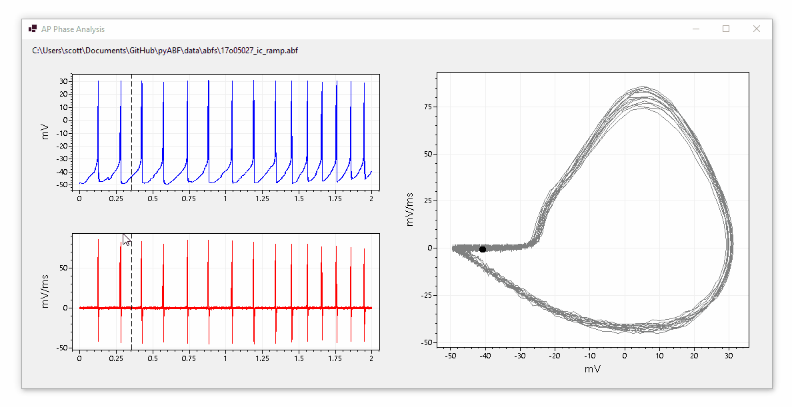

# AP Phase Analysis

**AP Phase Analysis** is a Windows Desktop application for inspecting action potential shapes and phase plots from data in ABF files.

## Download

* [**AP-phase-analysis-1.0.zip**](download/AP-phase-analysis-1.0.zip)

## Notes

* This application is written in C# and targets .NET 5.0 (Windows)

* [ScottPlot](https://swharden.com/scottplot) is used to interactively display data

* See the [ABFsharp](https://github.com/swharden/ABFsharp) project for details about reading ABF file data in C#

* The [Unofficial Guide to the ABF File Format](https://swharden.com/pyabf/abf2-file-format) has many notes about the binary structure of ABF files

* The [pyABF GitHub repo](https://github.com/swharden/pyABF/tree/master/data) has many sample ABFs you can experiment with